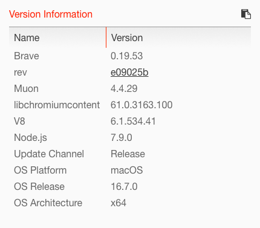

# UXSS-Vulnerabilities-Project
This project is carried by Antoine Rondelet and Ndeye Khady Ngom and ought to study and find UXSS vulnerabilities in the Brave Browser.

Here is the version of Brave we are using to carry out our project:


## Ideas to explore to try to find vulnerabilities:
*Legend:* :x: means that we tried but this was unsuccessful, :white_check_mark: means that we tried, and it worked.

- Tried to embed a website into an iFrame using XMLHttpRequest and tried to modify the headers of the request to try to modify the "Referer" and "User-Agent" headers and thus bypass the X-Frame-Options header of the "victim"/embedded website :x:

- Tried to bypass CORS using both XMLHTTPRequest and the fetch API, with custom headers but couldn't manage to have my request AND my crafted headers sent... (see: ./playground/corsByPassing.html for the code of my attempt) :x:

- Tried to add JS payload in the form of `testwebsite.com/test.pdf#<javascriptPayload>`
  - Without using any character escaping :x:
  - Using character escaping technics specified in https://www.owasp.org/index.php/XSS_Filter_Evasion_Cheat_Sheet :x:
  - Using "js-fuck" syntax (Javascript code written using only symbols) :x:

- Brave comes with some supported extensions. We should try to find if some vulnerabilities can be exploited in these extensions, and see if they can constitute a threat for the browser (like in https://events.ccc.de/congress/2006/Fahrplan/attachments/1158-Subverting_Ajax.pdf for instance) **--> TODO**

- Test whether it is possible to prevent Frame Busting scripts from working by doing variable clobbering (like in paper "Busting Frame Busting:
a Study of Clickjacking Vulnerabilities on Popular Sites") :x: This won't work since, it will only prevent some websites to escape the iFrame (Only the websites that don't use the `X-Frame-Options` header will be affected). However, this is NOT a vulnerability of the browser since the SOP is not bypassed once we embedded the website. So this is not going to help us trying to bypass the SOP for instance.

- Look at headers management on the code source of the browser and see if we can modify the "Referer" and/or the "User-Agent" **--> TODO**

- In the Brave code base, they escape "javascript" to avoid any javascript URL, using a non-case sensitive regex and an exact match on "javascript": Is there anything we can do to try to bypass such a regex ? Look into it
  - Already tried:
    - JAVASCRIPT :x:
    - JAVA%20SCRIPT :x:
    - %4A%41%56%41%53%43%52%49%50%54 (URL encoding of "JAVASCRIPT") :x:

- Embed a page with a X-Frame-Options: SAMEORIGIN header. Change the location of the current tab and block it directly via a javascript event, so that the parent's origin can match the origin of the website we try to embed, and abort the chnage of location instantaneously to stay on "malicious" page and have the good origin to bypass the SOP :x:

- Find more information about "Fuzzing" and try to see whether we could apply this method in our case (generate semi-valid JS to corrumpt V8 for instance) **--> TODO**
  - See: https://github.com/v8/v8/tree/master/test/fuzzer
  - Video Talk: https://www.youtube.com/watch?v=qTkYDA0En6U

- Change the domain of the document to try to set it to the victim's origin by doing `document.domain="victim.com%3A80"` since `document.domain` set an empty port by default :x:

- Investigate whether we could trigger a malicious behavior after bookmarking a page launched from a maliciously crafted URL (see: https://bugs.chromium.org/p/chromium/issues/detail?id=639126) **--> TODO**

- Using dialog box: freezes the browser and allow to bypass SOP **--> TODO**

- Tried to create a domainless `about:blank` page: Couldn't manage to reproduce https://www.brokenbrowser.com/uxss-edge-domainless-world/ (and, https://www.brokenbrowser.com/uxss-ie-domainless-world/, https://www.brokenbrowser.com/sop-bypass-uxss-tweeting-like-charles-darwin/) the domain is empty when I swith to `about:blank` using a link. Thus, when I try to embed a website into the iFrame -> frame busting since origins are different. :x:
Note: While trying to reproduce this scenario, I realized the different behavior between Safari and Brave (see pictures below):


In the case of Safari, about blank has not origin. However, in the case of Brave, about blank has an origin, which makes this attack unlikely to happen...

Note: With Safari, I managed to include bing.com into an iFrame on my about:blank page. The I tried many commands to try to execute code in this iFrame:
```
var frame = document.getElementsByTagName('iframe')[0]

frame.onmouseover = function() {var script = document.createElement('script'); script.type = 'text/javascript'; var code = 'alert("hello world!");'; script.appendChild(document.createTextNode(code)); document.body.appendChild(script);}
```

```
var frame = document.getElementsByTagName('iframe')[0]

frame.onmouseover = function() {var script = document.createElement('script'); script.type = 'text/javascript'; var code = 'alert("hello world!");'; script.appendChild(document.createTextNode(code)); document.body.appendChild(script);}
```

or

```
frame.onmouseover = function() {var script = document.createElement('script'); script.type = 'text/javascript'; var code = 'var string = "cookie: " + document.cookie; alert(string);'; script.appendChild(document.createTextNode(code)); document.body.appendChild(script);}
```

I tried to access `var innerDoc = frame.contentDocument || frame.contentWindow.document` the content of the iFrame, but Safari didn't let me do it...

Then I tried to copy the variable `frame` into another variable: `var mFrame = Object.create(frame);`, `var tfrBody = HTMLBodyElement(mFrame.contentDocument);`, in order to find a way to access the value of `frame.contentDocument` but all my attempts were rejected by Safari...

Also tried to block the browser while trying to change the location protocol and access the HTML elements inside the iFrame, didn't work either...:
```
window.setTimeout('alert("Blocking"); document.location.protocol = "http:"; var frame = document.getElementsByTagName("iframe")[0]; var bodyTarget = frame.contentDocument.getElementsByTagName("body")[0]; document.getElementById("savedValue").innerHTML = bodyTarget.innerHTML', 400);
```

- To explore: if we enter: `data:text/html,<script>alert("test")</script>`, then this code is executed in the browser. See what we can do with it (access some sensitive data ? escape from sandbox ? Read some data on other tabs ? Create a tab using this script and read data in it ? Embed a page and execute malicious code ?) **--> TODO**

- If we set the URL to `data:text/html,`, then if we open the developer console, and we do `document.body.innerHTML = '<iframe src="http://www.bing.com/images/search?q=microsoft+edge"></iframe>'`, then we can embed Bing on this page. I don't know what we can do with it, we need to investigate. At least, we should remember that we can execute some javascript under the `data:text/html,` URI. This can be useful... **--> TODO: Further research**

- Impossible to reproduce: https://www.brokenbrowser.com/sop-bypass-uxss-stealing-credentials-pretty-fast/ :x:

- See whether we could include the `about:passwords` into the `about:blank` page and try to execute malicious javascript that could retrieve the victim's data. I don't know whether it's possible or not. I tried to include `about:passwords` into a frame on the `about:blank` page, and it didn't work. Then I tried to clobber the `location` variable to prevent any frame busting from `about:passwords`. But this didn't work either. In order to clobber the `location` variable, I did `var location = 'test'`, but it changes the location of the document (looks like `location` is a singleton). Moreover, I tried to do `window.__defineSetter__("location", function(){})` but it didn't work either (error message saying thta I couldn't redefine `location`). I don't know whether focusing on these `"about:"` URI could be a good idea or not, but since they have no domain and the same protocol, we migth manage to do something. **Answer:** Yes we can embed `about:passwords` into any other `about:[page]` page since they have the same origin (`chrome-extension://mnojpmjdmbbfmejpflffifhffcmidifd/about-[page].html`). But this is not SoP bypassing... :x:

- Tried to use the `"history API"` to change the URL of the page without reloading it, but I couldn't exploit it to bypass the SoP... `window.history.pushState("test", "Title", "about:passwords");` (see: https://stackoverflow.com/questions/3338642/updating-address-bar-with-new-url-without-hash-or-reloading-the-page) :x:

- The page `about:bookmarks` offers a lot of possibilities: --> No way to execute malicious code inside this page (from another page) because of the `document.location` that is equal to `chrome-extension://mnojpmjdmbbfmejpflffifhffcmidifd/about-bookmarks.html` :x:
  - Import bookmarks from HTML file
  - Export bookmarks on user computer
  - Search for bookmarks --> This search tab can handle regex !! see whether we can use it to do malicious stuffs
Try to see whether such features could be used in a malicious manner to find a vulnerability that could be a threat for the user (steal bookmarks, write malicious data on user's computer, and so on...)

- Couldn't manage to exploit the `about:[page]` pages, since their origin is `chrome-extension://mnojpmjdmbbfmejpflffifhffcmidifd/about-about.html`. Those endpoints have their own origin that is an origin with a randomly looking string (which is not random btw), and which a `chrome-extension` protocol. So trying to access the content of such pages is equivalent than trying to bypass the SOP... No shortcut here... :x:


### Bonus : If no vulnerabilities found, inject a vulnerable plugin and proceed to UXSS attack. (Usable in the real world through phishing)

## Resources

### Interesting resources

- https://www.linkedin.com/pulse/abusing-insecure-cors-bypassing-csrf-protection-without-pundir

### IE

- https://www.brokenbrowser.com/revealing-the-content-of-the-address-bar-ie/

### Safari - Webkit

- https://github.com/Bo0oM/CVE-2017-7089/blob/master/index.html

### Chrome

- https://blogs.technet.microsoft.com/mmpc/2017/10/18/browser-security-beyond-sandboxing/
- https://cve.mitre.org/cgi-bin/cvename.cgi?name=CVE-2016-5181

